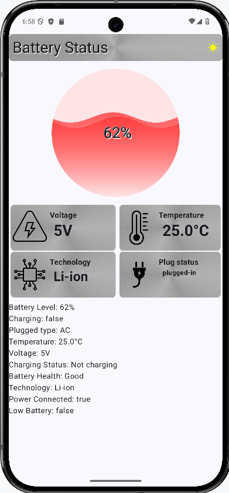
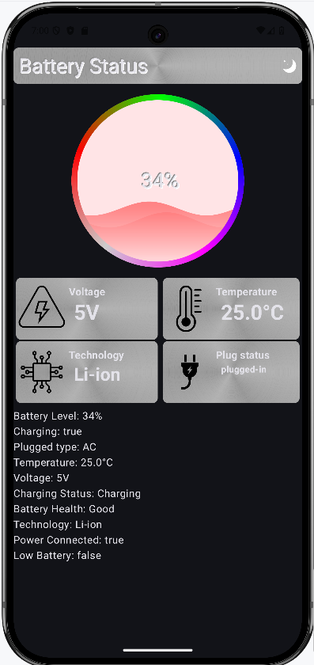

# Battery Information App

This Android application provides detailed information about the device's battery status, including charging state, health, temperature, voltage, and more. It's built using modern Android development practices with Jetpack Compose for the UI and follows a clean architecture approach.

## Features

*   **Real-time Battery Data:** Displays up-to-date information about the battery's current state.
*   **Charging Status:** Shows whether the device is charging, discharging, or not charging.
*   **Battery Level:** Displays the current battery percentage.
*   **Battery Health:** Indicates the overall health of the battery (e.g., Good, Cold, Overheat).
*   **Temperature:** Shows the battery's current temperature in Celsius.
*   **Voltage:** Displays the battery's voltage in millivolts.
*   **Technology:** Shows the battery's technology (e.g., Li-ion).
*   **Brushed Chrome Effect:** The UI incorporates a brushed chrome effect for a visually appealing design.

## Tech Stack

*   **Jetpack Compose:** Modern declarative UI toolkit for building native Android UIs.
*   **Kotlin:** The primary programming language for Android development.
*   **AndroidX:** A collection of libraries that enhance the Android framework.
*   **Android SDK:** The software development kit for Android.
*   **BatteryManager:** Android API for accessing battery information.

## Architecture

The project follows a clean architecture approach, separating concerns into distinct layers:

*   **UI Layer:** Contains the Jetpack Compose composables responsible for rendering the user interface.
*   **Data Layer:** Handles the retrieval and processing of battery information.
*   **Domain Layer:** (Optional) Could be added for more complex business logic.

## Screenshots

## Getting Started

1.  **Prerequisites:**
    *   Android Studio (latest version recommended)
    *   Android SDK (latest version recommended)
    *   A physical Android device or an emulator

2.  **Clone the Repository:**
3.  **Open in Android Studio:**
    *   Open Android Studio and select "Open an Existing Project."
    *   Navigate to the cloned repository and select the root directory.

4.  **Build and Run:**
    *   Connect your Android device or start an emulator.
    *   Click the "Run" button (green play icon) in Android Studio.
    *   Select your device or emulator as the deployment target.

## Brushed Chrome Effect

The brushed chrome effect is implemented using the `drawBehind` modifier in Jetpack Compose. The implementation is based on the article available here:

[https://www.sinasamaki.com/brushed-metal-ui-in-jetpack-compose/](https://www.sinasamaki.com/brushed-metal-ui-in-jetpack-compose/)

## Code Structure

*   **`ui/`:** Contains the Jetpack Compose UI code.
    *   **`components/`:** Reusable UI components (e.g., `EmbossedText`).
*   **`data/`:** Contains the data layer code.
    *   **`BatteryInformation.kt`:** Data class representing battery information.
*   **`MainActivity.kt`:** The main activity of the application.
*   **`build.gradle.kts`:** The build configuration file.

## Future Improvements

*   **Add a Domain Layer:** Introduce a domain layer to encapsulate business logic and make the code more testable.
*   **Add a ViewModel:** Implement a ViewModel to manage the UI state and handle data updates.
*   **More Detailed Information:** Display more detailed battery information, such as capacity, current, and charging history.
*   **Customizable UI:** Allow users to customize the appearance of the UI.
*   **Notifications:** Add notifications for low battery or full charge.
* **Add tests:** Add unit and UI tests.

## Contributing

Contributions are welcome! If you find a bug or have an idea for a new feature, please open an issue or submit a pull request.

## License

This project is licensed under the MIT License - see the [LICENSE](LICENSE) file for details.

## Contact

Donald McCaskey - [forteanjo@sky.com](mailto:forteanjo@sky.com)

Project Link: [https://github.com/forteanjo/battery_information](https://github.com/forteanjo/battery_information)
